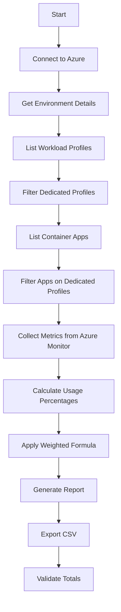

# Azure Container Apps Cost Breakdown Tool

A PowerShell-based CLI tool that calculates cost allocation percentages for Azure Container Apps running on shared Dedicated Workload Profiles within a Container Apps Environment.

## Overview

When multiple Container Apps share Dedicated Workload Profiles, Azure bills at the profile level, not per app. This tool analyzes actual resource usage (CPU, memory, replica runtime) to fairly allocate costs across apps.

## Features

- ✅ Queries Container Apps Environment and Workload Profiles via Azure CLI
- ✅ Collects CPU, memory, and replica metrics from Azure Monitor
- ✅ Calculates cost allocation using weighted formula (configurable)
- ✅ Exports detailed breakdown to CSV
- ✅ Validates allocation percentages sum to 100%
- ✅ Supports custom time ranges for analysis

## Prerequisites

### Required Tools
1. **PowerShell 7+** (or Windows PowerShell 5.1+)
2. **Azure CLI** - [Install](https://docs.microsoft.com/cli/azure/install-azure-cli)
3. **Azure PowerShell (Az module)** - Install with:
   ```powershell
   Install-Module -Name Az.Accounts -Scope CurrentUser
   ```

### Required Azure Permissions

The account running this script needs:
- **Reader** role on the Container Apps resources
- **Monitoring Reader** role for Azure Monitor metrics
- **(Optional) Cost Management Reader** role for future cost integration

## Installation

1. Clone or download this repository
2. Ensure all prerequisites are installed
3. Login to Azure:
   ```powershell
   # Azure PowerShell
   Connect-AzAccount
   
   # Azure CLI
   az login
   ```

## Usage

### Basic Usage

```powershell
.\Get-ACAEnvironmentCostBreakdown.ps1 `
    -SubscriptionId "your-subscription-id" `
    -ResourceGroupName "your-resource-group" `
    -EnvironmentName "your-container-app-env"
```

### Custom Time Range

```powershell
.\Get-ACAEnvironmentCostBreakdown.ps1 `
    -SubscriptionId "your-subscription-id" `
    -ResourceGroupName "your-resource-group" `
    -EnvironmentName "your-container-app-env" `
    -StartDate (Get-Date).AddDays(-7) `
    -EndDate (Get-Date)
```

### Custom Allocation Weights

```powershell
.\Get-ACAEnvironmentCostBreakdown.ps1 `
    -SubscriptionId "your-subscription-id" `
    -ResourceGroupName "your-resource-group" `
    -EnvironmentName "your-container-app-env" `
    -CpuWeight 0.5 `
    -MemoryWeight 0.4 `
    -ReplicaTimeWeight 0.1
```

### Using Configuration File

Create a config file from the example:
```powershell
cp config.example.json config.json
# Edit config.json with your values
```

Then run with parameters from config:
```powershell
$config = Get-Content config.json | ConvertFrom-Json
.\Get-ACAEnvironmentCostBreakdown.ps1 `
    -SubscriptionId $config.subscriptionId `
    -ResourceGroupName $config.resourceGroupName `
    -EnvironmentName $config.environmentName
```

## Parameters

| Parameter | Required | Default | Description |
|-----------|----------|---------|-------------|
| `SubscriptionId` | Yes | - | Azure Subscription ID |
| `ResourceGroupName` | Yes | - | Resource Group containing the environment |
| `EnvironmentName` | Yes | - | Container Apps Environment name |
| `StartDate` | No | 24 hours ago | Start of analysis period |
| `EndDate` | No | Now | End of analysis period |
| `CpuWeight` | No | 0.6 | Weight for CPU usage (0-1) |
| `MemoryWeight` | No | 0.3 | Weight for memory usage (0-1) |
| `ReplicaTimeWeight` | No | 0.1 | Weight for replica runtime (0-1) |
| `OutputPath` | No | Current directory | Output path for CSV report |

**Note:** Weights must sum to 1.0

## Cost Allocation Formula

The tool calculates cost allocation using a weighted formula:

```
App Cost % = (CPU% × CpuWeight) + (Memory% × MemoryWeight) + (ReplicaTime% × ReplicaTimeWeight)
```

Where:
- **CPU%** = App's average CPU usage / Total CPU usage on profile
- **Memory%** = App's average memory usage / Total memory usage on profile
- **ReplicaTime%** = App's replica-hours / Total replica-hours on profile

### Default Weights (Recommended)
- **CPU**: 60% - Primary driver of compute cost
- **Memory**: 30% - Secondary driver, especially for memory-optimized profiles
- **Replica Time**: 10% - Accounts for duration of resource occupation

### Alternative Allocation Methods

**Option 1: Pure CPU-based**
```powershell
-CpuWeight 1.0 -MemoryWeight 0.0 -ReplicaTimeWeight 0.0
```

**Option 2: Equal CPU/Memory**
```powershell
-CpuWeight 0.5 -MemoryWeight 0.5 -ReplicaTimeWeight 0.0
```

**Option 3: Replica-time dominant** (simpler, less accurate)
```powershell
-CpuWeight 0.2 -MemoryWeight 0.2 -ReplicaTimeWeight 0.6
```

## Output

### Console Output

The script displays:
1. Environment details
2. Workload profiles found
3. Container apps discovered
4. Metrics collection progress
5. Cost allocation results per app
6. Validation summary

Example:
```
===== COST ALLOCATION RESULTS =====

Workload Profile: myprofile-d4 (D4)

  my-api-app
    Cost Allocation: 65.43%
    - CPU Usage: 70.25% (2.105 cores avg)
    - Memory Usage: 58.32% (9.33 GiB avg)
    - Replica Time: 60.00% (144 replica-hours)

  my-worker-app
    Cost Allocation: 34.57%
    - CPU Usage: 29.75% (0.893 cores avg)
    - Memory Usage: 41.68% (6.67 GiB avg)
    - Replica Time: 40.00% (96 replica-hours)

  Total Allocation: 100.00%
```

### CSV Export

File: `ACA-CostBreakdown-{EnvironmentName}-{Timestamp}.csv`

Columns:
- AppName
- WorkloadProfile
- AvgCpuCores
- AvgMemoryGiB
- AvgReplicas
- ReplicaHours
- CpuUsagePercent
- MemoryUsagePercent
- ReplicaTimePercent
- **AllocatedCostPercent** ← Final cost allocation %

## How It Works



### Data Sources

1. **Azure CLI** (`az containerapp`)
   - Environment configuration (`az containerapp env show`)
   - Workload profile specifications with SKU types (from environment.properties.workloadProfiles)
   - Container app configurations

2. **Azure Monitor REST API** (`Microsoft.Insights/metrics`)
   - CPU usage (UsageNanoCores)
   - Memory usage (WorkingSetBytes)
   - Replica count (Replicas)

3. **Azure Resource Manager API**
   - Resource metadata
   - Authentication tokens

### SKU Detection

The script uses the `workloadProfileType` property from `az containerapp env show`, which reliably returns the SKU type (D4, D8, E4, E8, etc.) for each workload profile. This property is always populated correctly by Azure, eliminating the need for profile name parsing or fallback logic.

## Limitations & Considerations

### Current Limitations

1. **No Direct Cost Data**: Azure Cost Management API integration not yet implemented. Tool calculates allocation percentages only. You must manually retrieve actual costs from Azure Portal.

2. **Consumption Profiles**: Tool only analyzes **Dedicated Workload Profiles**. Consumption profiles are billed per-replica and don't need allocation.

3. **Cost Data Latency**: Azure Cost Management has 8-24 hour delay. Run analysis for historical periods, not real-time.

4. **Metric Retention**: Azure Monitor retains metrics for 93 days. Longer analysis requires exporting metrics separately.

### Accuracy Considerations

- **Shared Infrastructure Overhead**: Platform overhead not attributed to specific apps
- **Burst Workloads**: Apps with highly variable usage may show different allocations across time periods
- **Scaling Events**: Profile scaling affects attribution complexity
- **Reserved vs Actual**: Apps may reserve resources but not fully utilize them

### Best Practices

1. **Run Weekly/Monthly**: Analyze longer periods for accurate average allocation
2. **Compare Multiple Periods**: Identify trends and anomalies
3. **Document Methodology**: Share allocation formula with stakeholders
4. **Validate Results**: Ensure percentages sum to 100% per profile
5. **Cross-reference**: Compare with actual cost trends in Azure Portal

## Troubleshooting

### "Not logged in to Azure"
```powershell
Connect-AzAccount
az login
```

### "Environment not found"
- Verify subscription ID is correct
- Check resource group name and environment name
- Ensure you have Reader permissions

### "No dedicated workload profiles found"
- This environment uses only Consumption profiles
- Tool is designed for Dedicated profiles only

### "No metrics returned"
- Check time range (StartDate/EndDate)
- Verify apps were running during analysis period
- Ensure Monitoring Reader role assigned

### "Azure CLI not found"
Install from: https://docs.microsoft.com/cli/azure/install-azure-cli

## Roadmap

### Phase 1 (Current)
- ✅ Basic cost allocation calculation
- ✅ CSV export
- ✅ Configurable weights

### Phase 2 (Planned)
- ⬜ Azure Cost Management API integration
- ⬜ Actual cost amounts (not just percentages)
- ⬜ Multi-environment analysis
- ⬜ Historical trend analysis

### Phase 3 (Future)
- ⬜ Grafana dashboard export
- ⬜ Alerting for cost anomalies
- ⬜ Automated scheduling (Azure Automation)
- ⬜ Power BI integration

## Example: Complete Workflow

```powershell
# 1. Login to Azure
Connect-AzAccount
az login

# 2. Set variables
$subId = "12345678-1234-1234-1234-123456789abc"
$rg = "my-containerapp-rg"
$env = "my-aca-environment"

# 3. Run analysis for last 7 days
.\Get-ACAEnvironmentCostBreakdown.ps1 `
    -SubscriptionId $subId `
    -ResourceGroupName $rg `
    -EnvironmentName $env `
    -StartDate (Get-Date).AddDays(-7) `
    -EndDate (Get-Date) `
    -OutputPath "./reports"

# 4. View CSV report
Import-Csv ".\reports\ACA-CostBreakdown-my-aca-environment-*.csv" | Format-Table

# 5. Get actual costs from Azure Portal
# Navigate to: Cost Management + Billing > Cost Analysis
# Filter by Resource Group and review total costs

# 6. Calculate actual cost per app
# Multiply each app's AllocatedCostPercent by total profile cost
```

## Contributing

Contributions welcome! Areas for improvement:
- Cost Management API integration
- Support for Consumption profiles
- Additional metrics (network, storage)
- Visualization improvements
- Unit tests

## License

MIT License - See LICENSE file

## Support

For issues or questions:
1. Check Troubleshooting section
2. Review Azure Container Apps documentation
3. Open an issue in this repository

## Related Resources

- [Azure Container Apps Pricing](https://azure.microsoft.com/pricing/details/container-apps/)
- [Workload Profiles Documentation](https://learn.microsoft.com/azure/container-apps/workload-profiles-overview)
- [Azure Monitor Metrics](https://learn.microsoft.com/azure/azure-monitor/essentials/metrics-supported#microsoftappcontainerapps)
- [Azure Cost Management](https://learn.microsoft.com/azure/cost-management-billing/)
